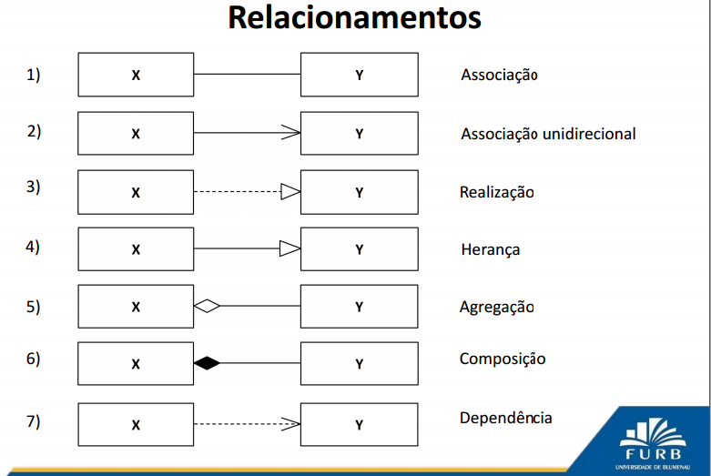

# [Padrões de Projeto] Catálogo
Catálogo com os padrões de projeto compreendidos.

## Criação
* [FactoryMethod/SimpleFactory](java/src/main/java/padroes/criacao/factoryMethod)

## Estrutural
* [Decorator](java/src/main/java/padroes/estrutural/decorator)
* [Adapter](php/test/Adapter/v0/AdapterV0MainTest.php)

## Comportamental
* [Strategy](java/src/main/java/comportamental/strategy)

## Relacionamento Diagrama

# Bibliografia
* Aulas OO na Furb
* https://brizeno.wordpress.com/padroes/
* http://www.inf.ufes.br/~vitorsouza/wp-content/uploads/java-br-curso-padroesdeprojeto-slides02.pdf
* https://sourcemaking.com/design_patterns
