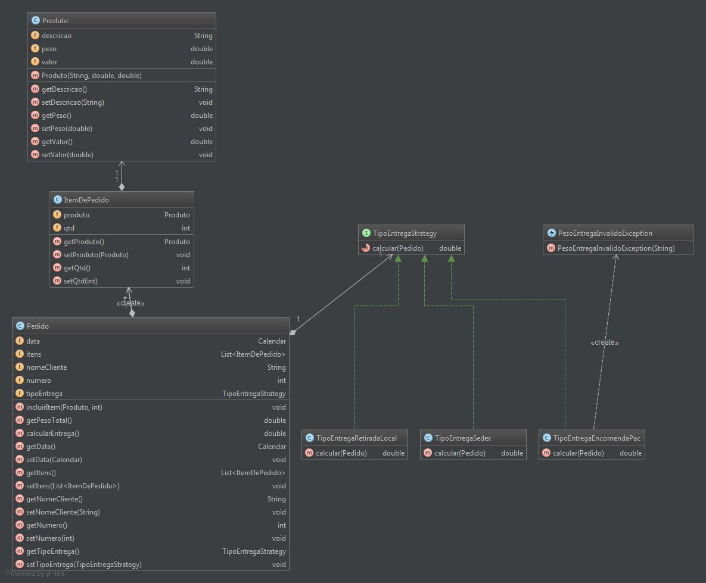

# Padrão de Projeto Estratégia - Estrutura do Modelo

* Contexto: define o contexto da aplicação (classe que precisa
  executar algum algoritmo)
* Estratégia: define a interface comum do comportamento
* ImplConcretaA, ImplConcretaB, ImplConcretaC, etc: definem as
  possíveis implementações do comportamento

## Diagrama Strategy v1
